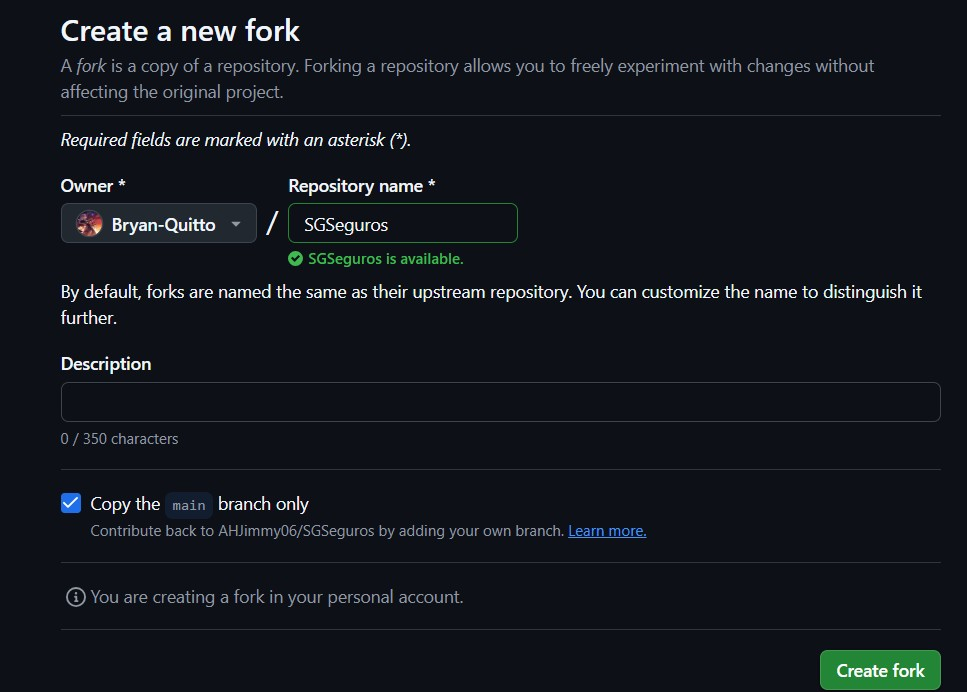
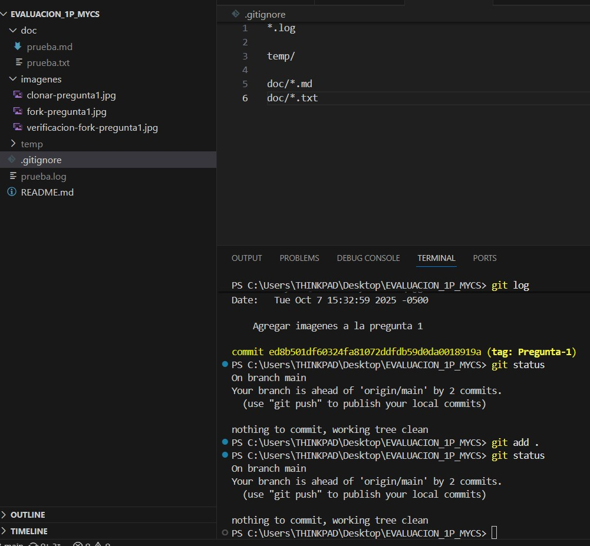
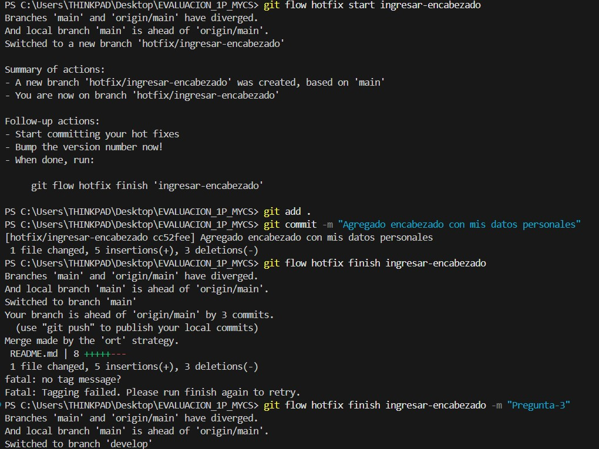
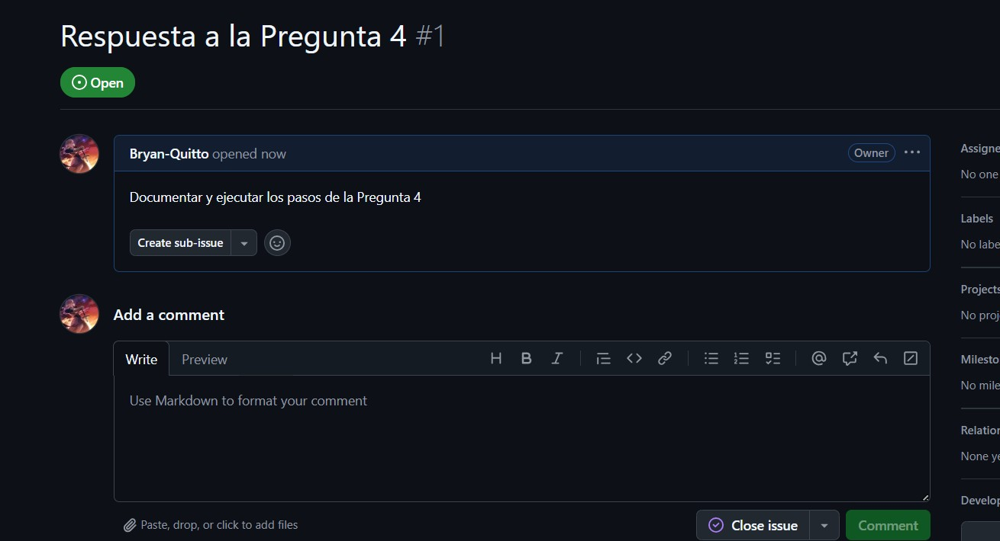
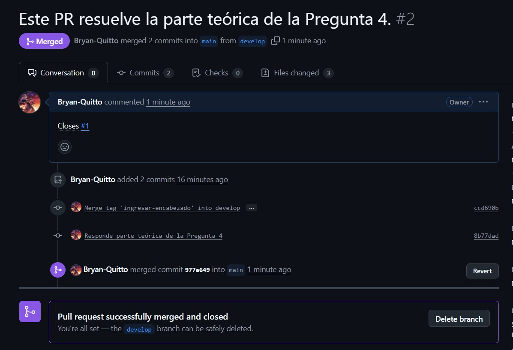

# Universidad [Nombre de la Universidad]  
## Facultad de [Nombre de la Facultad]  
### Carrera de Ingeniería en Software  

**Asignatura:** Manejo y Configuración de Software  
**Nombre del Estudiante:** Bryan Quitto (Pregunta 3)
**Fecha:** 07/10/2025 (Pregunta 3)

---

# Evaluación Práctica de Git y GitHub

## Instrucciones Generales

- Cada pregunta debe ser respondida directamente en este archivo **(README.md)** debajo del enunciado correspondiente.
- Cada respuesta debe ir acompañada de uno o más **commits**, según se indique en cada pregunta.
- Cuando se indique, deberán realizarse acciones prácticas dentro del repositorio (como creación de archivos, ramas, resolución de conflictos, etc.).
- Cada pregunta debe estar **etiquetada con un tag**, únicamente en el commit final correspondiente, con el formato: `"Pregunta 1"`, `"Pregunta 2"`, etc.

---

## Pregunta 1 (1 punto)

**Explicar la diferencia entre los siguientes conceptos/comandos en Git y GitHub:**

- `git clone`  
- `fork`  
- `git pull`

### Parte práctica:

- Realizar un **fork** de este repositorio en la cuenta personal de GitHub del estudiante.
- Luego, realizar un **clone** del fork en el equipo local.
- En este README, describir el proceso seguido:
  - ¿Cómo se realizó el fork?
  - ¿Cómo se realizó el clone del fork?
  - ¿Cómo se verificó que se estaba trabajando sobre el fork y no sobre el repositorio original?

**📝 Respuesta:**

git clone: clona un repositorio (copia local desde una URL).

fork: copia del repo en tu cuenta de GitHub (repositorio independiente).

git: pull → trae y aplica cambios desde un remoto (fetch + merge).

- ¿Cómo se realizó el fork?

  El fork se realizó una vez abierto el link del repositorio, y de ahi dando clic en el boton fork, luego se puso el nombre del repositorio y una descripción.

  

- ¿Cómo se realizó el clone del fork?

  Para realizar el clone del fork, se abrio una terminal en el escritorio, y se puso git clone https://github.com/santiagojara/EVALUACION_1P.git, siendo este el link del repositorio a clonar.

  

- ¿Cómo se verificó que se estaba trabajando sobre el fork y no sobre el repositorio original?
  
  Se verifico en el momento en el que se acaba de crear el fork, debajo de nombre del repositorio creado dice claramente: forked from santiagojara/EVALUACION_1P y si es que se va de nuevo al boton del fork dice claramente que no se puede hacer un fork de un repositorio del que somos propietarios.

  

---

## Pregunta 2 (1 punto)

**Configurar un archivo `.gitignore` para que ignore:**

- Todos los archivos con extensión `.log`.
- Una carpeta llamada `temp/`.
- Todos los archivos `.md` y `.txt`de la carpeta `doc/`. (Probar agregando un archivo `prueba.md` y un archivo `prueba.txt` dentro de la carpeta y fuera de la carpeta.)

### Requisitos:

1. Realizar un **primer commit** que incluya únicamente el archivo `.gitignore` con las reglas de exclusión definidas.
2. Realizar un **segundo commit** donde se explique en este README la función del archivo `.gitignore` y se muestre evidencia de que los archivos y carpetas indicadas no están siendo rastreadas por Git.

**Importante:**  
- Solo el **segundo commit** debe llevar el **tag `"Pregunta 2"`**.

**📝 Respuesta:**

El archivo `.gitignore` se utiliza para indicar a Git qué archivos o carpetas deben ser ignorados al momento de hacer seguimiento de cambios. 

En este caso, se configuró para que ignore:

- Todos los archivos con extensión `.log`.  
- La carpeta `temp/` completa.  
- Los archivos `.md` y `.txt` ubicados dentro de la carpeta `doc/`.

De esta forma, al ejecutar `git status`, se puede observar que los archivos y carpetas especificados **no aparecen como rastreados**, lo que confirma que la configuración funciona correctamente.

---

## Pregunta 3 (2 puntos)

**Utilizar Git Flow para desarrollar una nueva funcionalidad llamada `ingresar-encabezado`.**

### Requisitos:

- Inicializar el repositorio con Git Flow, utilizando las ramas por defecto: `main` y `develop`.
- Crear una rama de tipo `hotfix` con el nombre `ingresar-encabezado`.
- En dicha rama, **completar con los datos personales del estudiante** el encabezado que ya se encuentra al inicio de este archivo `README.md`.
- Realizar al menos un commit durante el desarrollo.
- Finalizar el hotfix siguiendo el flujo de trabajo establecido por Git Flow.

### En este README, se debe incluir:

- Los **comandos exactos** utilizados desde la inicialización de Git Flow hasta el cierre del hotfix.
- Una descripción del **proceso seguido**, indicando el propósito de cada paso.
- Una reflexión sobre las **ventajas de aplicar Git Flow**, especialmente en contextos colaborativos o proyectos de larga duración.

**Importante:**

- Deben realizarse varios commits durante esta pregunta.
- **Solo el commit final** debe llevar el **tag `"Pregunta 3"`**.
- El flujo debe respetar la estructura de Git Flow con las ramas `develop` y `main`.

**📝 Respuesta:**

Evidencia pregunta 3:

---

## Pregunta 4 (2 puntos)

**Trabajo con Issues y Pull Requests**

### Parte teórica:

- Explicar qué es un **issue** en GitHub.
- Explicar qué es un **pull request** y cuál es su finalidad.
- Indicar la diferencia entre ambos y cómo se relacionan en un entorno de trabajo colaborativo.

### Parte práctica:

- Trabajar en la rama `develop`, ya existente desde la configuración de Git Flow.
- Crear un **issue** titulado `"Respuesta a la Pregunta 4"`, en el que se indique que su objetivo es documentar esta pregunta.
- Realizar los cambios necesarios en este archivo `README.md` para responder esta pregunta.
- Realizar un **commit** con los cambios y subirlo a la rama `develop` del repositorio remoto.
- Crear un **pull request** desde `develop` hacia `main` en GitHub.
- **Vincular el pull request con el issue creado**, de manera que al ser aprobado y fusionado, el issue se cierre automáticamente.
- **Aprobar** el pull request para que se haga el merge respectivo hacia `main`.

### En este README, se debe incluir:

- Un resumen del procedimiento realizado.
- El número y enlace del issue creado.
- El número y enlace al pull request.

**📝 Respuesta:**

*   **¿Qué es un issue en GitHub?**
    Un *issue* (o incidencia) en GitHub es una herramienta para el seguimiento de tareas, mejoras, errores o preguntas sobre el proyecto. Funciona como un foro de discusión para un tema específico, permitiendo a los colaboradores discutir problemas, proponer nuevas funcionalidades y planificar el trabajo. Cada issue tiene un título, una descripción, y puede ser asignado a personas, etiquetado y organizado en proyectos.

*   **¿Qué es un pull request y cuál es su finalidad?**
    Un *pull request* (PR) o solicitud de extracción es la forma en que un desarrollador propone cambios a un repositorio. Su finalidad es notificar al equipo que has completado una tarea o solucionado un problema en una rama separada y que deseas que tus cambios sean revisados e integrados (*merge*) en una rama principal, como `develop` o `main`. Un PR muestra las diferencias exactas entre tu rama y la rama de destino, permitiendo la revisión de código, la discusión y la realización de ajustes antes de la fusión final.

*   **Diferencia y relación entre ambos**
    La principal diferencia es su propósito: un **issue** *describe* un trabajo que se debe hacer, mientras que un **pull request** *propone* los cambios de código que resuelven ese trabajo.

    Se relacionan directamente en un flujo de trabajo colaborativo:
    1.  Se abre un **issue** para reportar un error o solicitar una nueva funcionalidad.
    2.  Un desarrollador toma el issue, crea una nueva rama y trabaja en la solución.
    3.  Una vez terminado, crea un **pull request** con los cambios.
    4.  El pull request se vincula al issue original. De esta manera, al fusionar el PR, el issue asociado se puede cerrar automáticamente, dejando un registro claro de qué problema se solucionó y con qué cambios.

### Resumen del Procedimiento Realizado

1.  **Creación del Issue:** Se creó un issue en GitHub para registrar la tarea de responder la Pregunta 4.
2.  **Cambio de Rama:** En el repositorio local, me posicioné en la rama `develop` usando `git checkout develop`.
3.  **Edición y Commit:** Se editó el archivo `README.md` para añadir las respuestas teóricas. Luego, se realizó un commit con estos cambios y se subió a la rama `develop` del repositorio remoto con `git push origin develop`.
4.  **Creación del Pull Request:** Desde la interfaz de GitHub, se creó un pull request para fusionar los cambios de la rama `develop` en la rama `main`.
5.  **Vinculación del Issue:** En la descripción del pull request, se añadió la palabra clave `Closes #N` (donde N es el número del issue) para vincularlo y automatizar su cierre.
6.  **Merge:** Finalmente, se aprobó y fusionó el pull request, integrando los cambios en la rama `main` y cerrando automáticamente el issue correspondiente.

---

## Pregunta 5 (2 puntos)

**Resolver conflictos entre ramas y realizar un Pull Request**

### Requisitos:

- Crear dos ramas llamadas `ramaA` y `ramaB`, ambas a partir de la rama `develop`.
- En `ramaA`, crear un archivo llamado `archivoA.txt` con el contenido:  
  `Contenido A`
- En `ramaB`, crear un archivo con el mismo nombre (`archivoA.txt`), pero con el contenido:  
  `Contenido B`
- Intentar fusionar `ramaB` sobre `ramaA`, lo cual debe generar un conflicto.
- Resolver el conflicto combinando ambos contenidos.
- Realizar el merge de `ramaA` hacia `develop`.
- Crear un **pull request** desde `develop` hacia `main`.
- Una vez completado lo anterior, eliminar las ramas `ramaA` y `ramaB` tanto local como remotamente.

### En este README, se debe incluir:

- El procedimiento completo:
  - Cómo se crearon las ramas.
  - Cómo se generó y resolvió el conflicto.
  - Cómo se realizó el merge hacia `develop`.
  - Cómo se eliminaron las ramas al finalizar.
- El enlace al pull request.
- Una breve explicación de qué es un conflicto en Git y por qué ocurrió en este caso.

**📝 Respuesta:**

<!-- Escribe aquí tu respuesta completa a la Pregunta 5 -->

---

## Pregunta 6 (2 puntos)

**Realizar limpieza, explicar versionamiento semántico y enviar cambios al repositorio original**

### Requisitos:

- Trabajar en la rama `develop` del fork del repositorio.
- Eliminar los archivos `archivoA.txt` y `archivoB.txt` creados en preguntas anteriores.
- Realizar un merge desde `develop` hacia `main` en el repositorio local.
- Enviar los cambios de la rama `main` local a la rama `develop` del repositorio remoto (fork). Recuerde incluir todos los tags creados (6 tags).
- Finalmente, crear un **pull request** desde la rama `develop` del fork hacia la rama `main` del repositorio original (del cual se realizó el fork en la Pregunta 1). El titulo del pull request debe ser "NOMBRE APELLIDOS", en la descripción colocar el link de su repositorio de GitHub.

### En este README, se debe incluir:

- Una explicación del proceso realizado paso a paso.
- Una explicación del **versionamiento semántico**, indicando:
  - En qué consiste.
  - Sus tres componentes (MAJOR, MINOR, PATCH).
- El enlace al pull request creado hacia el repositorio original.
- Si hace falta agregar alguna evidencia adicional, agregue un tag adicional que sea `Version Final`.

**📝 Respuesta:**

<!-- Escribe aquí tu respuesta completa a la Pregunta 6 -->
